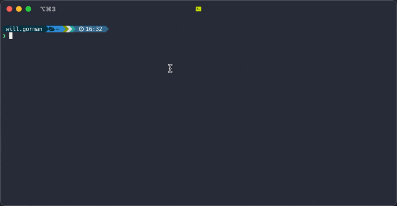

# teash

Put some bubbletea in your tsh.  Teash is a TUI built with the [bubbletea](https://github.com/charmbracelet/bubbletea) framework that can interactively browse for and connect to a [Teleport](https://goteleport.com/) server.



## Installation

### brew

```sh
brew tap willgorman/teash https://github.com/willgorman/teash
brew install willgorman/teash/teash 
```

### go install

```
go install github.com/willgorman/teash@latest
```

When installing using this method you'll need to also [install the appropriate Teleport package containing `tsh`](https://goteleport.com/docs/installation/) for your system.

## Usage

`teash` uses Teleport's `tsh` command so you'll need to have that installed as well.  Log in with `tsh` as usual:

```sh
tsh login --proxy=your-proxy.example.com --auth=your-auth-provider
```

Then run `teash`.   Use `tsh` to manage sessions and `teash` will work with the active profile.

### Commands

In scroll mode
* `/` - start a fuzzy search using all columns
* `c` - activate column selection mode
* `q` - quit
* `enter` - close `teash` and connect to the selected server

In column selection mode
* Select a number corresponding to a column to enter search mode using just that column
* `esc` - return to scroll mode
  
